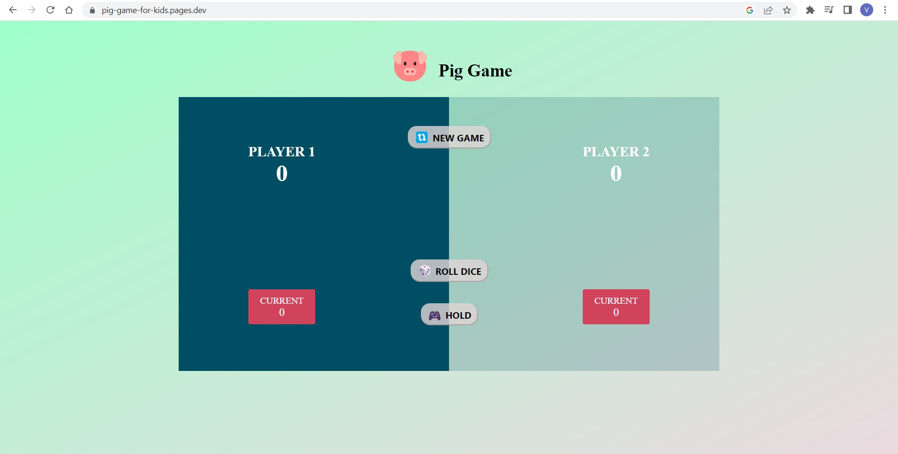
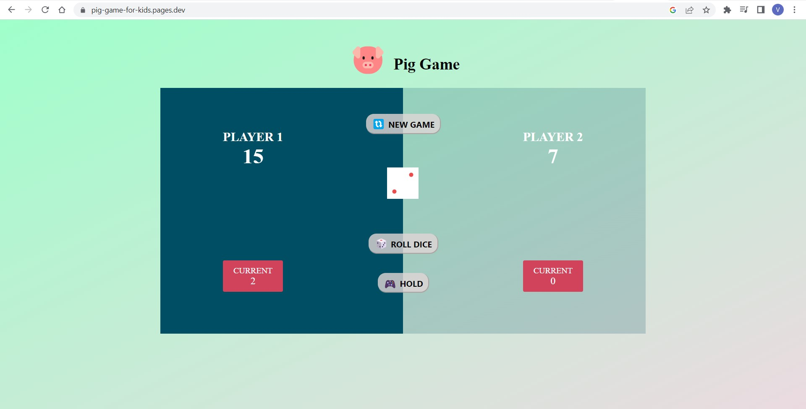
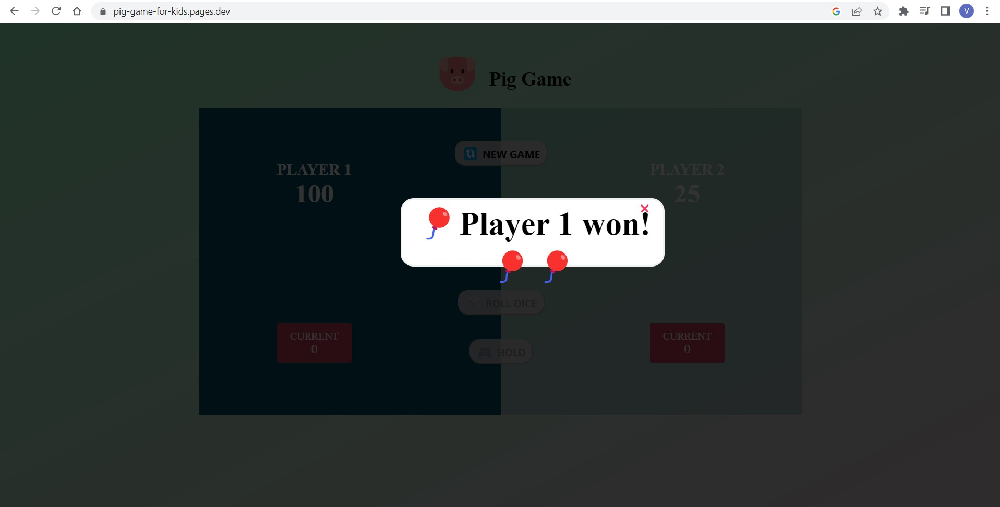

# Pig-Game

The game of Pig involves rolling a single die in turns, where the player keeps rolling until they either roll a 1 or choose to "hold" their current score. The game continues until one of the players reaches a score of 100 or more points, at which point they are declared the winner.

This website is built using the JavaScript programming language and is hosted on the Cloudflare platform.

 
 
 

 
**Languages**

**URL**

https://pig-game-for-kids.pages.dev
